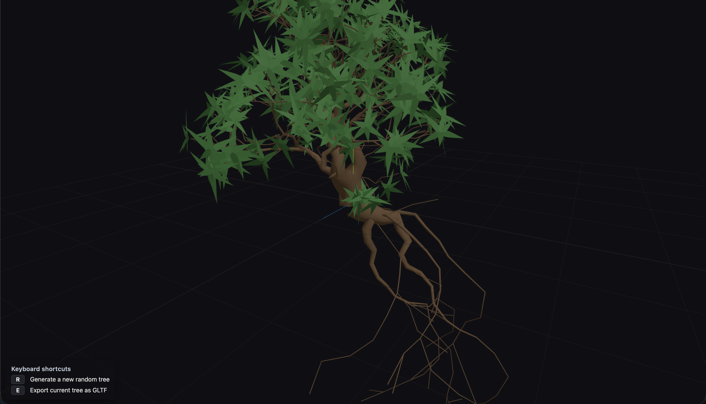

# Terrain System

## Terrain Generation & LOD Grids

Terrain height is generated procedurally by sampling octaved noise (fBm/ridged variants) per grid vertex. Rendering uses concentric LOD rings (coarser farther out) centered on the camera: each ring is a reusable grid mesh that queries the noise in a different world-space region, so only a handful of meshes stream/update as you move. This keeps detail high near the viewer while maintaining performance; tweak noise parameters and ring sizes in the terrain module to change look and scale.

## Stone Layers: Generation & Rendering

Stones are generated per terrain cell using cached metadata (cell center and height range) and simple noise/mask rules per layer (e.g., slope, height bands). Cells are visibility-tested (near camera or frustum-intersect) before populating, then each stone is assigned to a distance-based LOD bucket and rendered via InstancedMesh for efficiency. Buckets are filled from nearest cells first to prioritize quality close to the viewer, and per-LOD geospheres receive post-displacement normal smoothing for lighting.

## Material Shader Injection: Ocean-Like Atmospherics

The terrain material (src/terrain/materials.ts) injects small GLSL snippets via onBeforeCompile to simulate ocean-like atmospherics: water absorption, backscatter, and simple air fog, alongside slope/elevation-based layer blending. Tweak these effects by adjusting the uniforms set in makeTerrainMaterial (e.g., uWaterAbsorbPack, uWaterScatterPack, uWaterColor, uAirFogDensity). If you update Three.js, ensure the shader chunk replacement strings still match and set material.needsUpdate if you change the injected code.

## Water: Reflections and Refractions

Water.ts renders planar reflections and refractions into offscreen targets each frame using mirrored cameras and clip planes, then samples those textures in the ocean shader with time-warped normals to create animated waves. In short: two render targets (reflection/refraction), a mirrored view for reflection, a below-surface clip for refraction, and a lightweight Fresnel mix give convincing angled “mirror” water that works from both sides of the plane. Tune resolution and wave animation inside Water.ts for performance/quality.
